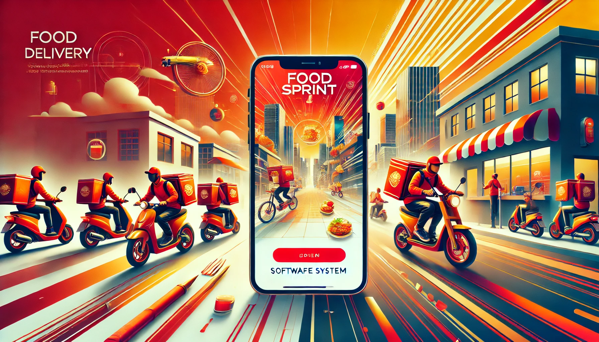

🚀 FoodSprint（快餐達人）— 智慧食品外送平台

📌 介紹  
FoodSprint 是一款 多角色、多功能 的食品外送平台，覆蓋 用戶點餐、餐廳接單、外送配送 等完整流程。  
開發者可使用 Mirage JS 在前端模擬後端 API，無需依賴真實後端，即可開發、測試與展示前端功能。

🔹 主要功能
✅ 用戶端（Customer App）

- 註冊/登入（Google、Facebook、Email）
- 瀏覽餐廳，篩選與收藏
- 點餐、優惠券與支付整合（Stripe、Apple Pay）
- 訂單追蹤（實時查看外送進度）
- 訂單評價與問題反饋

✅ 餐廳端（Restaurant Dashboard）

- 註冊/登入，驗證餐廳身份
- 菜單管理（添加/編輯/刪除菜品）
- 訂單管理（接收/處理/完成訂單）
- 銷售分析報表

✅ 外送員端（Delivery App）

- 註冊/登入，驗證身份與交通工具
- 訂單接收與管理
- 導航與路徑規劃（Google Maps API）
- 收入管理與結算

✅ 管理員端（Admin Panel）

- 監控所有訂單流程
- 用戶、餐廳、外送員管理
- 訂單與配送數據分析

📌 技術棧
🔹 前端

- React.js / Next.js（前端框架）
- Mirage JS（前端模擬 API）
- Redux Toolkit（狀態管理）
- Tailwind CSS / Ant Design（UI 設計）
- WebSocket / Firebase（即時通訊）

🔹 後端

- Node.js + Express.js / NestJS（API 服務）
- PostgreSQL / MongoDB（數據存儲）
- Redis（快取數據）
- Socket.IO（訂單狀態更新）

🔹 DevOps & 部署

- Docker（容器化部署）
- AWS / GCP / Vercel（雲端托管）
- CI/CD（GitHub Actions）（自動化部署）

---
